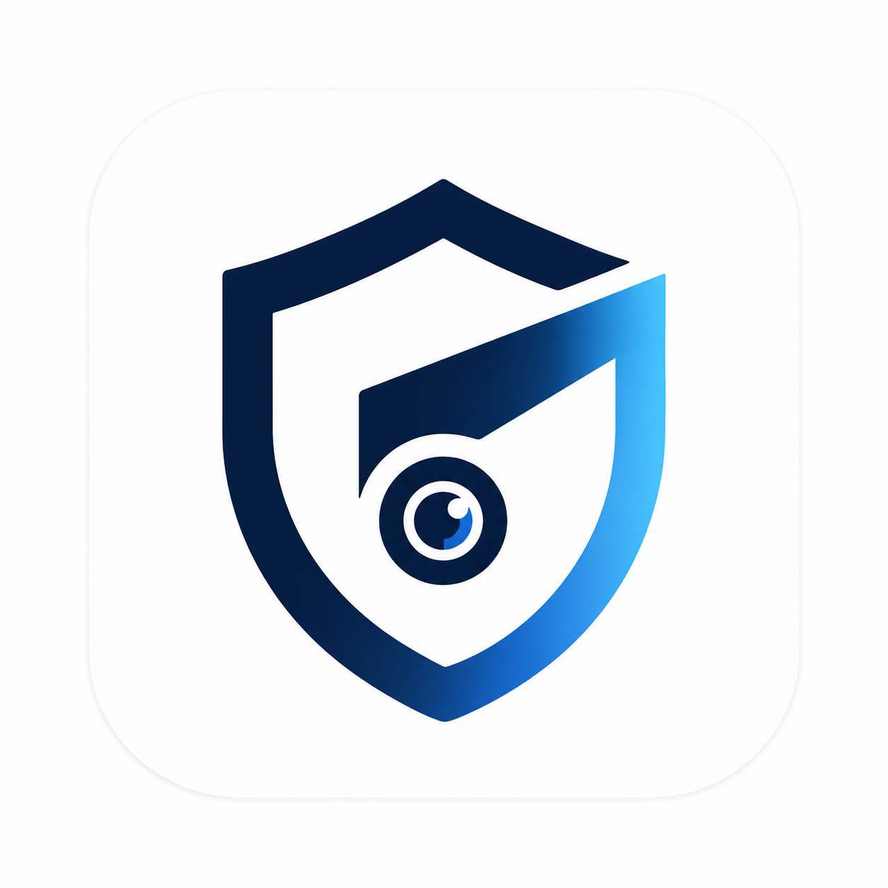

<p align="center">
  
</p>

# MobiSentra AI

> **Turning existing CCTV infrastructure into intelligent safety sensors for public mobility.**

[](https://github.com/rohit3576/MobiSentra-AI/actions/workflows/ci.yml)
[](LICENSE)

MobiSentra AI is an open-source computer-vision platform that adds an **AI intelligence layer on top of existing public-transport CCTV** — buses, metro coaches, railway coaches, stations and terminals. It converts video streams into real-time **safety events** (falls, overcrowding, altercations, zone intrusions) instead of recording footage nobody watches.

> **Detect safety events, not identities.** No facial recognition, no re-identification, no demographic inference — by design and in code. See [Responsible Use](#responsible-use).

---

## How it works

```text
                          ┌──────────────┐
                          │ BUS / METRO  │
                          │ CCTV CAMERAS │        (or bundled sample videos —
                          └──────┬───────┘         no hardware required)
                                 │ RTSP / MP4
                                 ↓
                     ┌──────────────────────┐
                     │ MOBISENTRA EDGE AI   │   YOLO26 + ByteTrack + pose
                     │ Detection / Tracking │   + rules engine
                     │ Pose / Zones / Fall  │
                     └──────────┬───────────┘
                                │ MQTT (QoS 1, disk-spooled)
                                ↓
                     ┌──────────────────────┐
                     │ MQTT→KAFKA GATEWAY   │   zero event loss, moving vehicle safe
                     └──────────┬───────────┘
                                ↓
                     ┌──────────────────────┐
                     │ BACKEND (Node.js/TS) │   PostgreSQL history + Redis live state
                     └──────────┬───────────┘   + Socket.IO push
                                ↓
                     ┌──────────────────────┐
                     │ CONTROL CENTER       │   live cameras, incidents,
                     │ DASHBOARD (React)    │   evidence clips, replay
                     └──────────────────────┘
```

## Status

| Capability | State |
|---|---|
| Dev infrastructure (Kafka, EMQX, PostgreSQL, Redis, MLflow) | ✅ Phase 0 |
| CloudEvents schema v0 + camera registry | ✅ Phase 0 |
| Video ingestion (RTSP/MP4/webcam, lag-free, auto-reconnect) | ✅ Phase 1 |
| Person detection + tracking (YOLO26n + tuned BoT-SORT) | 🟡 Phase 2 built — gate decision pending |
| Zones / fall / altercation | 🚧 Phases 3–5 |
| Event engine + messaging | 🚧 Phases 6–7 |
| Backend services (Kafka consumer, REST, Socket.IO) | ✅ Phase 8 — Gate 8 passed |
| Control center dashboard | 🚧 Phase 9 → **v0.1.0** |

Full roadmap: [`Doc/Implementation/implementation-sequence.md`](Doc/Implementation/implementation-sequence.md)

## Quickstart (dev stack)

```bash
git clone https://github.com/rohit3576/MobiSentra-AI.git
cd mobisentra
docker compose -f infra/docker-compose.yml up -d
```

This brings up the full development stack (no cameras needed):

| Service | Port | Purpose |
|---|---|---|
| Kafka (KRaft) | 9092 | Server-side event backbone |
| EMQX (MQTT) | 1883 / 18083 | Edge→server messaging + bridge |
| PostgreSQL | 5432 | Event/incident history |
| Redis | 6379 | Live state |
| MLflow | 5000 | Model tracking |
| Backend | 3000 | REST API + Socket.IO push (`docker compose up -d backend`) |

The edge pipeline and dashboard arrive with the phase roadmap above — see the [implementation sequence](Doc/Implementation/implementation-sequence.md).

## Repository layout

```
edge/        Python vision pipeline (runs on vehicle/edge GPU)
backend/     Node.js + TypeScript consumer, API, WebSocket
dashboard/   React control-center UI
bridge/      MQTT→Kafka gateway service (EMQX OSS has no Kafka connector)
mlops/       DVC pipelines, MLflow, drift monitoring
infra/       docker-compose dev stack, deployment files
schemas/     Shared CloudEvents JSON Schemas (v0)
Doc/         Plans, research notes, implementation runbook
```

## Contributing

See [CONTRIBUTING.md](CONTRIBUTING.md). The project must always **run without hardware**: bundled sample videos are the default input; real RTSP is a config change, never a requirement. Good first issues are labeled accordingly.

## Responsible Use

- MobiSentra detects **safety events, not identities** — enforced in code (identity features are never extracted).
- Only event clips + metadata leave the vehicle; never continuous video.
- Face blur on evidence clips where identification isn't required; retention expiry per operator policy.
- Covert surveillance of individuals is explicitly out of scope and against this project's license + policy.

## License

[AGPL-3.0](LICENSE) — driven by the `ultralytics` (YOLO11) dependency. Dataset/model-weight licenses are documented per item in the model zoo.
